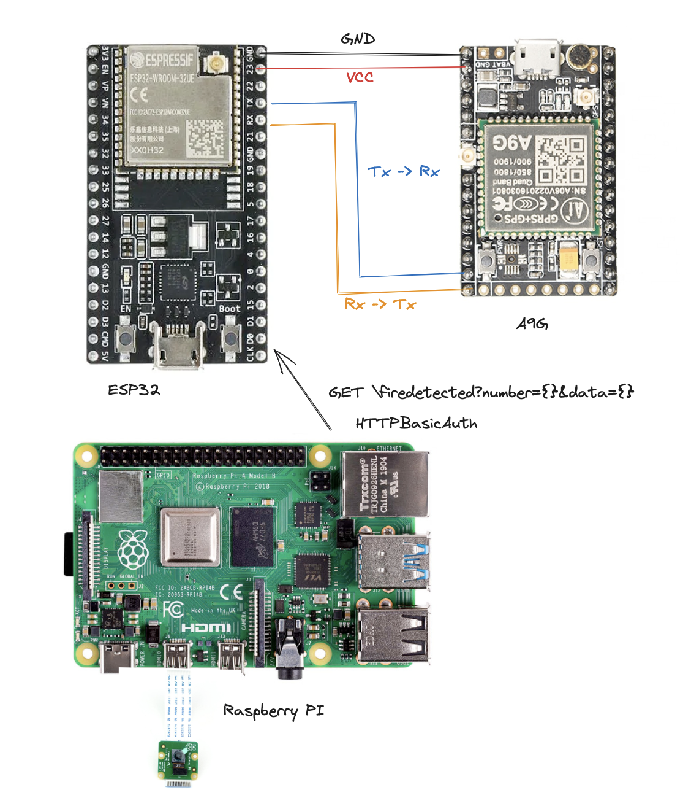

# AI_crusade_forest_fire_detection

## Synopsis

Ecological, Environmental, Economic Impact of Forest fire is the main motivation for the project. Majority of forest fires in Nepal are uncontrolled and have devastating impact. Although Nepal has seen impressive restoration of its forests, March and April have been threatening the progress of our restoration. According to [Nepal Economic Forum](https://nepaleconomicforum.org/what-is-flaring-nepals-issue-of-forest-fires/), 6279 forest fires were recorded in 2021. According to the 2021 Long-Term Climate Risk Index, Nepal ranked 10th globally, highlighting the worsening effects of forest fires due to increased hot and dry conditions.

We propose a portable forest Fire detection device. Tldr, it is a computer vision model to detect forest fire and a hardware accelerated feedback system which: 

- Uses real time inference using cameras and detects forest fire. 
- Sends GPS coordinates, Forest fire images and alert feedbacks to the forest rangers or respective authorities. 

## AI Tools Details 

- Fire.pt pytorch model fine tuned with yolov8n architecture.
- Uses OpenCV for boundary box display in real time video 

## Hardware Details

- Uses SBC like Raspberry PI for real time forest detection
- PI detects and sends a HTTP GET request to ESP32 Microcontroller with Image link and Number as parameter
- ESP32 sends AT commands to A9G Pudding which then gets the GPS data and then sends the message to the number with image and coordinates

## Steps for running the Fire inference Model
- `pip3 install -r requirements.txt` 

## Steps For Hardware 

    

- The components should be connected according to schematics

